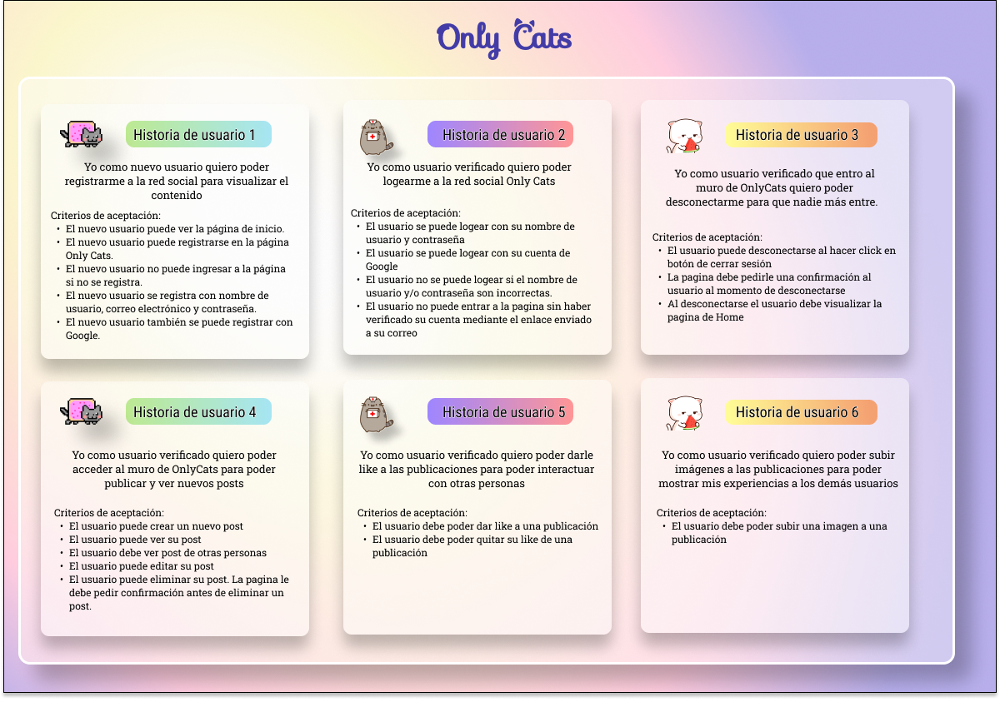
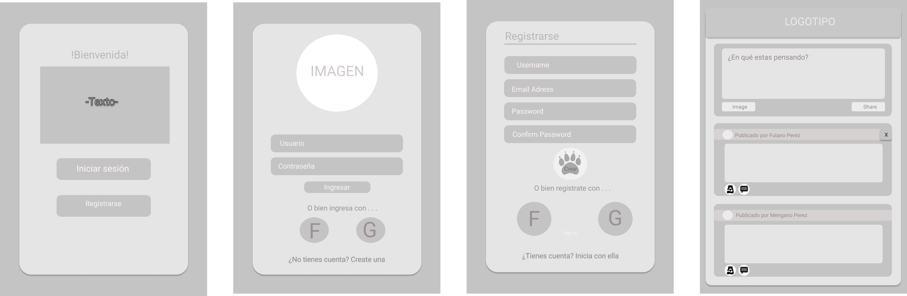
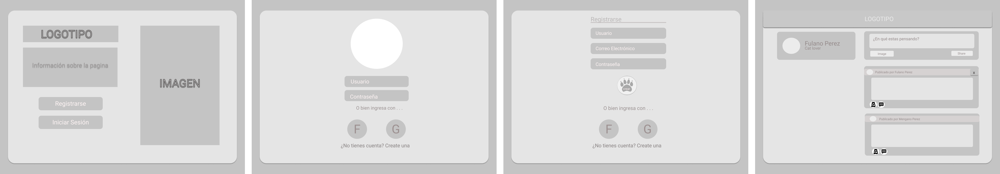
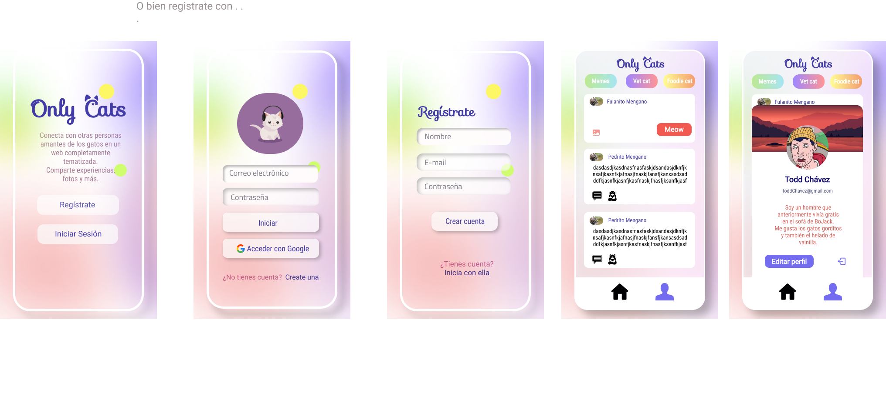
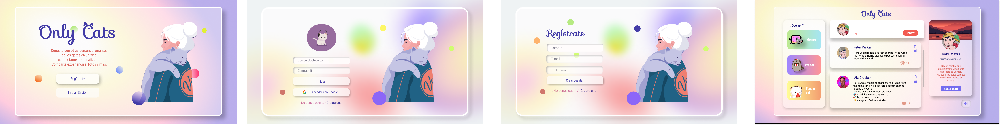

# Only Cats

## Índice

* [1. Preámbulo](#1-preámbulo)
* [2. Resumen del proyecto](#2-resumen-del-proyecto)
* [3. Historias de usuario](#4-historia-de-usurio)
* [5. Pagina web](#5-pagina-web)

## 1. Preámbulo

Instagram, Snapchat, Twitter, Facebook, Twitch, Linkedin, etc. Las redes
sociales han invadido nuestras vidas. Las amamos u odiamos, y muchos no podemos
vivir sin ellas.

Hay redes sociales de todo tipo y para todo tipo de intereses. Por ejemplo,
en una ronda de financiamiento con inversionistas, se presentó una red social
para químicos en la que los usuarios podían publicar artículos sobre sus
investigaciones, comentar en los artículos de sus colegas, y filtrar artículos
de acuerdo a determinadas etiquetas o su popularidad, lo más reciente, o lo
más comentado.

## 2. Resumen del proyecto
Red social que permite a cualquier usuario crear una cuenta de
acceso y loguearse con ella; crear, editar, borrar y _"likear"_ publicacciones.
## 3. Historias de usuario

### 3.1 Definición del producto

En el `README.md` cuéntanos brevemente cómo descubriste las necesidades de los
usuarios y cómo llegaste a la definición final de tu producto. Es importante
que detalles:

* Quiénes son los principales usuarios de producto.
* Qué problema resuelve el producto / para qué le servirá a estos usuarios.

### 3.2 Historias de usuario

Una vez que se entendio las necesidades de los usuarixs, se escribieron. Cada
una de las Historias de Usuario tiene:

* **Criterios de Aceptación:** Todo lo que debe ocurrir para satisfacer las
  necesidades del usuario.

* **Definición de terminado:** Todos los aspectos técnicos que cumplen. **Todas** las Historias de Usuario (salvo excepciones),incluyen estos aspectos en su Definición de Terminado:
  - Son SPA.
  - Son _responsive_.
  - Han recibido _code review_ de al menos una compañera de otro equipo.
  - Contienen _test_ unitarios
  - Se testearon manualmente buscando errores e imperfecciones simples.
  - Se hicieron _pruebas_ de usabilidad e incorporaron el _feedback_ de los
    usuarios como mejoras.
  - Se desplegaron su aplicación y etiquetaron la versión (git tag).

### 3.3 Diseño de la Interfaz de Usuario (prototipo de baja fidelidad)

El prototipo de baja fidelidad definira el flujo que seguirá el usuario dentro de la web y, con eso, se diseño la Interfaz de Usuario:

* Vista mobile

* Vista Dekstop

### 3.4 Responsive

Debe verse bien en dispositivos de pantallas grandes
(computadoras/es, laptops, etc.) y pequeñas (_tablets_, celulares, etc.). Te
sugerimos seguir la técnica de _`mobile first`_ (más detalles sobre esta técnica
al final).

* Vista mobile

    

* Vista Desktop

    

* Vista Tablet

## 4. Página web
